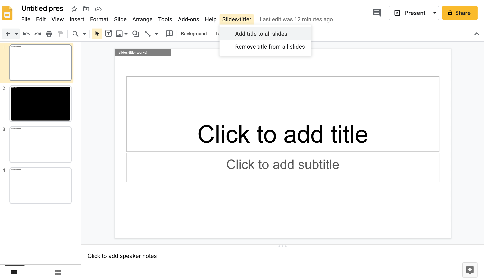
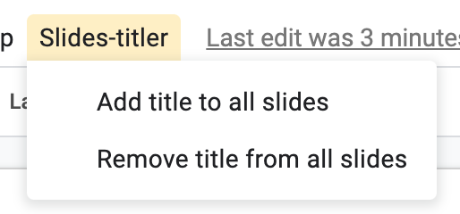
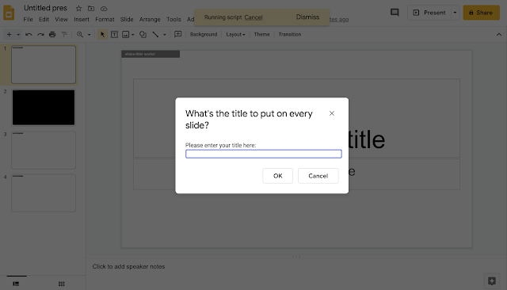

# [ Slides Titler](https://gsuite.google.com/marketplace/app/foo/117735578843)

<https://gsuite.google.com/marketplace/app/foo/117735578843>

Create a tiny title to show up on each slide.

This add-on makes it easier to add the title to each slide. If you decide you don't want it anymore, there's an option to remove all the titles that were automatically added by this add-on.

## Slides Titler Privacy Policy and Terms of Service:

<https://docs.google.com/document/d/1VA-8WLP3njOA6chajUP9VYqJaFn9AjEMQ5jAT4FH5Vs/edit?usp=sharing>

## To learn to create your own Google Apps Scripts:

<https://github.com/hchiam/learning-google-apps-script>

## To learn about publishing Google Workspace Add-ons:

<https://developers.google.com/gsuite/add-ons/overview>

<https://developers.google.com/gsuite/add-ons/how-tos/publish-add-on-overview>

<https://www.youtube.com/watch?v=6jcc3xm7aRU>

You'll need to find the "Store Listing" page inside "APIs & Services - Google Workspace Marketplace SDK", with a link like this: <https://console.cloud.google.com/apis/api/appsmarket-component.googleapis.com/googleapps_sdk_publish?project=slides-titler>
